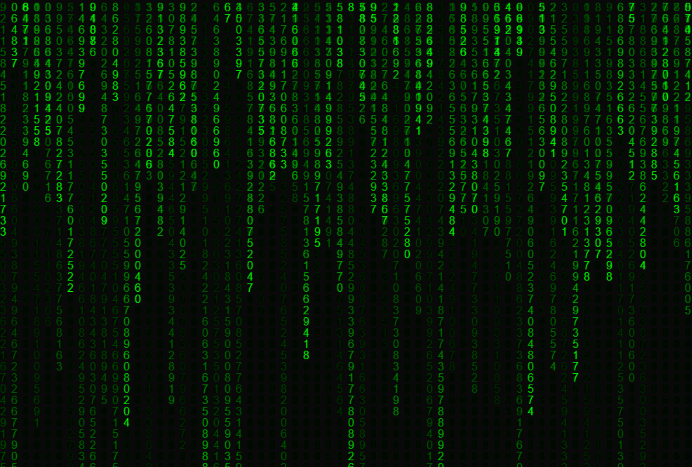

# Efeito Matrix com Javascript

Desenvolvido para aprendizado. Realizado efeito matrix (chuva de código) com animação em JS. 15/10/22

[🔗 Clique aqui para acessar] (https://michel-maia.github.io/Efeito-Matrix-com-Javascript/)

## 💻 Tecnologias

- HTML
- CSS
- Javascript

## Referência

- [Youtube] https://www.youtube.com/channel/UC0SEvxbpTF9fH6n2uVa-Muw

- [mozilla] https://developer.mozilla.org/pt-BR/docs/Web/API/Canvas_API/Tutorial/Basic_animations

